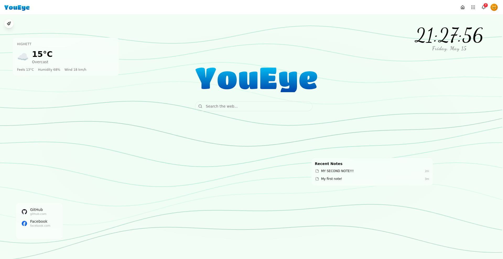

# YouEye

**Self-hosted personal cloud that feels like a consumer product.**

> **Not so public beta** - YouEye is under active development. Breaking changes can and will occur between releases. APIs, configuration formats, and database schemas may change without migration paths. Back up your data before upgrading.

One command installs a full platform: dashboard with widgets, six native apps, SSO, reverse proxy, DNS, and an app marketplace. Runs on any Debian/Ubuntu server or Proxmox LXC.



## Quick Start

```bash
curl -sSL https://raw.githubusercontent.com/YouEye-Platform/YouEye/main/spine/install.sh | sh
```

The installer downloads the `youeye` CLI and launches an interactive TUI with environment detection and guided setup. A progress bar tracks the installation. When it finishes, open `https://your-server-ip` in your browser and create your account.

> Requires a fresh Debian 12+ or Ubuntu 24.04+ system with root access. See [full install guide](#install-options) for Proxmox LXC, branch installs, and manual setup.

## Features

| | |
|---|---|
| **Dashboard** | Customizable home screen with drag-and-drop widgets (clock, weather, notes, bookmarks, search, word art, and more) |
| **Native Apps** | Six built-in apps: Wiki, Search, Notes, Cinema, Weather, Translate |
| **App Marketplace** | Install third-party apps from the catalog with one click |
| **Single Sign-On** | Authentik-powered SSO across all apps and services |
| **Themes** | OKLCH color system with light/dark mode and animated backgrounds |
| **Internationalization** | Full i18n support with language propagation across all apps |
| **Reverse Proxy** | Caddy with automatic HTTPS and domain routing |
| **DNS Filtering** | Pi-Hole integration for network-wide ad blocking |
| **Backups** | Multi-container backup engine with scheduled snapshots |
| **PWA** | Install as a Progressive Web App on any device |

<!-- TODO: add 4-6 screenshots showing dashboard, app drawer, control panel, setup wizard -->

## Architecture

```
Host (Debian/Ubuntu)
  youeye (Spine CLI)  ── manages itself + Control Panel
    Control Panel container (Incus)
      PostgreSQL 17
      Authentik (SSO/OIDC)
      Caddy (reverse proxy, HTTPS)
      Pi-Hole v6 (DNS)
      YouEye UI (user dashboard)
      Native apps (Wiki, Search, Notes, Cinema, Weather, Translate)
      Marketplace apps
```

**Spine** is a Go binary that bootstraps the entire stack. It installs Incus, creates an unprivileged container, deploys the Control Panel inside it, and then gets out of the way. The Control Panel orchestrates everything else: database, SSO, reverse proxy, DNS, the UI, and all apps.

## Tech Stack

| Component | Stack |
|-----------|-------|
| **Spine** | Go 1.21+, Cobra CLI, Bubble Tea TUI, Unix socket API |
| **Control Panel** | Next.js 16, TypeScript, Incus API, Authentik API |
| **UI** | Next.js 15, Drizzle ORM, Radix UI, DND-Kit, Framer Motion |
| **Native Apps** | Next.js 15, YouEye Canvas SDK |
| **Infrastructure** | Incus (LXD), PostgreSQL 17, Authentik, Caddy, Pi-Hole v6 |

## Native Apps

Six apps ship with the platform, each running in its own container with full SSO integration:

| App | Description |
|-----|-------------|
| **Wiki** | Wikipedia-style article browser with infobox parsing, search, and reading lists |
| **Search** | Unified search across all platform apps and services |
| **Notes** | Card-based note-taking with tags, checklists, reminders, and dashboard widgets |
| **Cinema** | Movie and TV discovery powered by TMDB with watchlists and sharing |
| **Weather** | Multi-location weather with Open-Meteo, forecasts, and dashboard widgets |
| **Translate** | Privacy-friendly translation with history, bookmarks, and auto-detect |

Each app provides dashboard widgets and integrates with the platform's theme, language, and notification systems.

## Monorepo Structure

This repository contains the three core components:

| Directory | Component | Description |
|-----------|-----------|-------------|
| `spine/` | [Spine](spine/) | Go CLI that bootstraps and manages the platform |
| `control-panel/` | [Control Panel](control-panel/) | Next.js orchestration engine for all infrastructure |
| `ui/` | [UI](ui/) | Next.js user-facing dashboard with widgets and themes |

Each component is versioned and released independently.

## Current Versions

| Component | Version |
|-----------|---------|
| Spine | 0.4.0 |
| Control Panel | 0.4.0 |
| UI | 0.4.0 |
| Wiki | 0.4.0 |
| Search | 0.4.0 |
| Notes | 0.4.0 |
| Cinema | 0.4.0 |
| Weather | 0.4.0 |
| Translate | 0.4.0 |

## Related Repositories

| Repository | Description |
|------------|-------------|
| [Market](https://github.com/YouEye-Platform/Market) | App marketplace catalog (YAML manifests) |
| [Wiki](https://github.com/YouEye-Platform/Wiki) | Wiki native app |
| [Search](https://github.com/YouEye-Platform/Search) | Search native app |
| [Notes](https://github.com/YouEye-Platform/Notes) | Notes native app |
| [Cinema](https://github.com/YouEye-Platform/Cinema) | Cinema native app |
| [Weather](https://github.com/YouEye-Platform/Weather) | Weather native app |
| [Translate](https://github.com/YouEye-Platform/Translate) | Translate native app |

## Install Options

### One-Line Install (recommended)

```bash
curl -sSL https://raw.githubusercontent.com/YouEye-Platform/YouEye/main/spine/install.sh | sh
```

This downloads and installs the `youeye` CLI, then launches the interactive TUI installer. The installer detects your environment and guides you through setup with a live progress bar while the platform deploys.

### Install from a Branch

```bash
curl -sSL https://raw.githubusercontent.com/YouEye-Platform/YouEye/main/spine/install.sh | sh -s -- --branch dev
```

### Non-Interactive Install

When piped without a terminal, the installer skips the TUI and prints next steps:

```bash
curl -sSL https://raw.githubusercontent.com/YouEye-Platform/YouEye/main/spine/install.sh | sh
youeye installer   # Launch the TUI manually
# or
youeye deploy      # Skip the TUI and deploy directly
```

### Manual Install

```bash
# Download Spine binary directly
curl -LO https://github.com/YouEye-Platform/YouEye/releases/download/spine-v0.4.0/spine-linux-amd64
chmod +x spine-linux-amd64
mv spine-linux-amd64 /usr/local/bin/youeye

# Deploy
youeye deploy
```

### Proxmox LXC

Create an unprivileged Debian 12 LXC with nesting enabled, then run the one-line install inside it.

## Platform Management

```bash
youeye status          # Full platform health check
youeye deploy          # Deploy the entire stack
youeye installer       # Launch the interactive TUI installer
youeye update self     # Update Spine
youeye update control  # Update Control Panel
youeye cleanup         # Clean uninstall
youeye branch set dev  # Switch release channel
```

## Development

```bash
# Spine (Go)
cd spine && go build ./cmd/youeye

# Control Panel (Next.js 16)
cd control-panel && pnpm install && pnpm dev

# UI (Next.js 15)
cd ui && pnpm install && pnpm dev
```

**Always use pnpm**, never npm. Branch from `dev`, never from `main`.

## Contributing

YouEye is in its **not so public beta**. Contributions are welcome, but expect breaking changes between releases.

1. Fork the repository
2. Create your branch from `dev`
3. Make your changes
4. Submit a pull request

## License

YouEye source code is licensed under the [Business Source License 1.1](LICENSE). After four years, each version converts to [AGPL-3.0](https://www.gnu.org/licenses/agpl-3.0.html).

The "YouEye" name and logo are trademarks. See [TRADEMARK.md](TRADEMARK.md) for usage guidelines.
