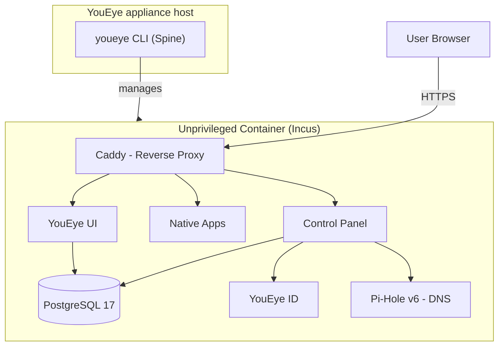

# YouEye

## Repository-owned builds and signed releases

The executable unsigned entrypoints and strict manifests under `.youeye/build/`
belong to this repository. The release control plane binds the exact branch,
commit and version, executes isolated builds with a pinned toolchain, validates
declared outputs, generates provenance and SPDX metadata, and signs outside the
builder. Entrypoints never receive credentials or signing material, and Node
dependency installation is frozen and offline.

Development Spine, Control Panel, UI and native-app runtime update paths verify
the embedded development Ed25519 trust identity, the detached signature over
the exact checksum document, the artifact digest and any configured channel
digest before mutation. Stable promotion remains separately keyed and independently authorized;
development trust is not Stable authority.

**A self-hosted personal cloud with a polished dashboard, native apps, and one-click installs.**

> **Public beta** - YouEye is under active development. Breaking changes can occur between releases. Back up your data before upgrading.

The YouEye Installer writes one verified appliance image with A/B system slots,
independent Recovery, persistent State and Data, then performs a health-gated
first deployment. Run it from the signed ISO on a physical machine or let its
Proxmox mode create and install the VM.

## Quick Start

### Proxmox

```bash
curl -fsSL https://releases.youeye.me/install.sh | sh
```

Run this command from the Proxmox host's root shell; `sudo` is not required.
The canonical public bootstrap verifies the separately provisioned Stable key,
signed checksums, release identity, and provenance-bound `release-lock.json`.
Unprovisioned source builds fail closed; Development keys never authorize Stable.
The bootstrap defaults to the official GitHub Stable lane and supports
explicit Forgejo or custom HTTPS sources without prefilled private endpoints.
Public discovery uses a signed [release catalog](docs/release-distribution.md)
without a GitHub token. It verifies the signed checksum set and exact
installer digest, then opens the YouEye Installer TUI. Quick mode creates a
Q35/OVMF VM with 4 vCPU, 8 GiB RAM, and one 128 GiB installation drive. The
host-side flow provisions the VM and media; the booted ISO owns disk discovery,
destructive confirmation, imaging, and installed-system setup.

Development and beta releases are selected explicitly. Public beta uses its
own provisioned beta anchor; Development uses Development trust. Each published release
page carries the exact source commit, signed checksums, manifests, provenance,
SBOM, and component release set required for independent verification.

### Signed ISO

Download `youeye-appliance-amd64.iso`, `SHA256SUMS`, and `SHA256SUMS.sig` from
the same appliance release, verify them, write the ISO to removable media, and
boot it in UEFI mode. The interactive `youeye-installer install` flow performs
the same installation used by Proxmox.
After exact first deployment becomes healthy, open the HTTPS address shown on
the appliance console and create the single YouEye ID owner. There is no
default appliance password. The interactive installer requires a root password
for local console recovery. SSH is key-only unless **Root password SSH** is
explicitly enabled; that option permits the same password only from the directly
connected IPv4 subnet. Public-key import is separate. Only a password hash is
stored in protected answer media and State. See the [SSH troubleshooting guide](docs/getting-started.md#root-ssh-access).

> Proxmox mode requires root access, Q35/OVMF support, an ISO storage pool, and
> an eligible VM-image storage pool. Direct installation requires x86-64 UEFI
> hardware and a dedicated 32 GiB or larger drive. See the
> [full install guide](docs/getting-started.md).

## Features

| | |
|---|---|
| **Dashboard** | Customizable home screen with drag-and-drop widgets (clock, weather, notes, bookmarks, search, word art, and more) |
| **Native Apps** | Six built-in apps: Wiki, Search, Notes, Cinema, Weather, Translate |
| **Market** | Install apps and future add-ons from trusted catalogs with one click |
| **Single Sign-On** | YouEye ID powers SSO across all apps and services |
| **Themes** | OKLCH color system with light/dark mode and animated backgrounds |
| **Internationalization** | Full i18n support with language propagation across all apps |
| **Reverse Proxy** | Caddy with automatic HTTPS and domain routing |
| **DNS Filtering** | Pi-Hole integration for network-wide ad blocking |
| **Backups** | Multi-container backup engine with scheduled snapshots |
| **PWA** | Install as a Progressive Web App on any device |

Public screenshots will be added from synthetic demo accounts after the privacy
and third-party-content review defined in `docs/assets/screenshots/README.md`.

## Architecture


```mermaid
graph TD
    User[User Browser] -->|HTTPS| Caddy

    subgraph Host["YouEye appliance host"]
        Spine["youeye CLI (Spine)"]
    end

    Spine -->|manages| Container

    subgraph Container["Unprivileged Container (Incus)"]
        CP[Control Panel]
        Caddy[Caddy - Reverse Proxy]
        ID[YouEye ID]
        DB[(PostgreSQL 17)]
        DNS[Pi-Hole v6 - DNS]
        UI[YouEye UI]
        Apps[Native Apps]
    end

    Caddy --> UI
    Caddy --> Apps
    Caddy --> CP
    CP --> DB
    CP --> ID
    CP --> DNS
    UI --> DB
```

**Spine** is a Go binary that bootstraps the entire stack. It installs Incus, creates an unprivileged container, deploys the Control Panel inside it, and then gets out of the way. The Control Panel orchestrates everything else: database, YouEye ID, reverse proxy, DNS, the UI, and all apps.

> See [Architecture docs](docs/architecture.md) for the full security model and data flow diagrams.

## Tech Stack

| Component | Stack |
|-----------|-------|
| **Spine** | Go 1.21+, Cobra CLI, Bubble Tea TUI, Unix socket API |
| **Control Panel** | Next.js 16, TypeScript, Incus API, YouEye ID |
| **UI** | Next.js 15, Drizzle ORM, Radix UI, DND-Kit, Framer Motion |
| **Native Apps** | Next.js 15 |
| **Infrastructure** | Incus (LXD), PostgreSQL 17, YouEye ID, Caddy, Pi-Hole v6 |

## Native Apps

Six apps ship with the platform, each running in its own container with full SSO integration:

| App | Description |
|-----|-------------|
| **Wiki** | Wikipedia-style article browser with infobox parsing, search, and reading lists |
| **Search** | Unified search across all platform apps and services |
| **Notes** | Card-based note-taking with tags, checklists, reminders, and dashboard widgets |
| **Cinema** | Movie and TV discovery powered by TMDB with watchlists and sharing |
| **Weather** | Multi-location weather with Open-Meteo, forecasts, and dashboard widgets |
| **Translate** | Privacy-friendly translation with history, bookmarks, and auto-detect |

Each app provides dashboard widgets and integrates with the platform's theme, language, and notification systems. See [Apps documentation](docs/apps.md) for feature and integration details.

## Monorepo Structure

This repository contains the core platform and installer components:

| Directory | Component | Description |
|-----------|-----------|-------------|
| `spine/` | [Spine](spine/) | Go CLI that bootstraps and manages the platform |
| `control-panel/` | [Control Panel](control-panel/) | Next.js orchestration engine for all infrastructure |
| `ui/` | [UI](ui/) | Next.js user-facing dashboard with widgets and themes |
| `installer/` | YouEye Installer | Signed-media and Proxmox installation flows |
| `appliance/` | Appliance image | A/B/Recovery image construction and boot lifecycle |

Core components are versioned independently. Appliance releases bind their
exact Spine, Control Panel, and UI source commits, tags, and signed digests.

## Versions and releases

Core components are versioned independently. The Installer is an
appliance-owned overlay shipped inside the appliance release; it has no
independent release version or publication lane. See the repository's release
page for the current signed appliance identity, component source identities,
checksums, and downloadable assets. Development and Stable are separate signing
and publication boundaries.

## Related Repositories

| Repository | Description |
|------------|-------------|
| [Market](https://github.com/YouEye-Platform/Market) | Official Market catalog (YAML manifests) |
| [Wiki](https://github.com/YouEye-Platform/Wiki) | Wiki native app |
| [Search](https://github.com/YouEye-Platform/Search) | Search native app |
| [Notes](https://github.com/YouEye-Platform/Notes) | Notes native app |
| [Cinema](https://github.com/YouEye-Platform/Cinema) | Cinema native app |
| [Weather](https://github.com/YouEye-Platform/Weather) | Weather native app |
| [Translate](https://github.com/YouEye-Platform/Translate) | Translate native app |

## Licensing and third-party material

YouEye source is distributed under [LICENSE](LICENSE), and product marks follow
[TRADEMARK.md](TRADEMARK.md). Bundled third-party material is recorded in
[THIRD_PARTY_NOTICES.txt](THIRD_PARTY_NOTICES.txt) and the source registry at
[`legal/third-party-assets.json`](legal/third-party-assets.json). Entries marked
for owner, trademark, privacy, or provenance review must be resolved before a
public Stable release.

## Documentation

Full documentation lives in the [`docs/`](docs/) folder:

- [Getting Started](docs/getting-started.md) — Installation, first login, CLI commands
- [Dashboard](docs/dashboard.md) — Widgets, backgrounds, edit mode
- [Apps](docs/apps.md) — Native apps and Market
- [Settings](docs/settings.md) — All configuration options
- [Control Panel](docs/control-panel.md) — Infrastructure administration
- [Architecture](docs/architecture.md) — System design, security model, diagrams

## Install Options

### Proxmox beta or development release

Use the same public bootstrap and explicitly select a credential-free HTTPS
release source. For example:

```bash
curl -fsSL https://releases.youeye.me/install.sh | \
  sudo sh -s -- --provider forgejo \
    --releases-api https://forge.example.test/api/v1/repos/example/YouEye/releases \
    --channel development
```

Quick mode uses six focused pages: VM, resources, storage/network, read-only
Official GitHub Stable software policy, access, and review. It defaults to 4
vCPU, 8 GiB RAM, one 128 GiB installation drive and wired DHCP. Advanced mode
uses eight pages and adds independent storage, network, signed software source,
SSH, and Development-access controls. It supports Stable, Development, a safe
branch-associated signed release track, or an immutable exact tag/digest.
Branches select published signed releases only; raw source and mutable branch
archives are never installed, and no missing or invalid selection falls back.

The mutable Debian/Ubuntu host installer and Debian-cloud Proxmox VM/LXC
providers are retired; they did not implement the signed appliance layout,
Recovery, A/B updates, or sealed-image guarantees.

Create provisions a new Q35/OVMF VM with persistent EFI variables, serial console, one stably identified installation drive, installer ISO, and non-secret answer media. Reinstall accepts only a stopped compatible layout-3 appliance VM, displays its drive identity and discovered GPT contents, and requires the generated phrase naming that target before reuse. The helper never writes guest partitions: the signed ISO verifies the same bundle again and owns all disk mutation, A/B/Recovery installation, first boot, and setup readiness.

Recovery boots from its own read-only image and can inspect the offline appliance, select either System slot once, verify and repair signed boot assets, and export support evidence. Its interactive session remains on the local tty1 display and is mirrored read-only to the serial console for remote observation and acceptance. For support export, prepare a FAT32, ext4, or exFAT filesystem labelled `YOUEYE-SUP`; Recovery mounts it with restrictive options, writes one timestamped evidence file, syncs it, and unmounts it. The earlier `YOUEYE-SUPPORT` ext4 label remains accepted for development compatibility.

Appliance system updates verify one exact signed `youeye.system-update.v1` manifest, cache artifacts on `YE-DATA`, write and read back only the inactive 8 GiB System slot, and arm a three-attempt systemd-boot trial. Operationally healthy trials are explicitly blessed; failed trials automatically return to the prior known-good slot while State, Recovery, and `YE-DATA` remain unchanged. Settings checks Stable or Development metadata automatically every six hours, but download/preparation and restart always require an administrator action. The CLI exposes the same `status`, `check`, `stage`, and `activate --reboot` transaction.

Appliance builds also seal one exact official Market commit into the signed
System root. First deployment seeds that immutable catalog identity before
Control Panel deployment, without replacing an existing owner-selected Market
source. Development builders may supply an explicit HTTPS source and exact
commit without changing distributed defaults.

The signed appliance source commit identifies the complete image/installer build. Its embedded Spine, Control Panel, and UI release set independently pins each consumed component's exact tag, source commit, and artifact digest. Those identities may differ after an appliance-only or single-component repair; every pin remains mandatory and verified, so unrelated unchanged components are not rebuilt merely to make commit strings equal.

Development release identities may use a safe multi-segment source branch such
as `codex/phase1-repository-builds`. Every segment is validated as a bounded
Git-ref component; empty/traversal-like components, `.lock` suffixes, ref
metacharacters, and tags that do not exactly match the branch and version are
rejected.

Direct ISO installation captures the same release and access policy before it
erases a disk. A stable Ethernet MAC selector is recorded when available, so a
multi-adapter machine does not silently switch uplinks after an A/B update.
Before the Server interface exists, the local TTY1/serial bootstrap verifies
link, IPv4 address, route, DNS, usable clock, HTTPS reachability, and the
selected release index. Failed changes restore the last-known-good wired
profile. This release supports Ethernet DHCP/static IPv4 only; it does not
pretend to support Wi-Fi hardware without an approved chipset and firmware
matrix.

The first-boot transaction freezes one signed appliance identity, follows only
declared signed System bridges when an older bootstrap cannot jump directly,
writes the inactive A/B slot, resumes after reboot, and installs the exact
signed Server-interface and UI tags and digests. TTY1 reports bounded real
deployment stages. TTY2 is a normal PAM root login only when locally enabled;
`youeye-installer network` and `youeye-installer development-access` provide
the supported on-device repair paths. An administrator may inspect or disable
Development access in Settings, but enabling it or changing its password stays
physical-console-only.

The supported minimum is 2 vCPU, 4 GiB RAM, and one 32 GiB installation drive;
128 GiB is recommended. Below 64 GiB the Installer shows a strong capacity
warning. The ISO always creates one GPT containing a 1 GiB ESP, 4 GiB Recovery,
equal 8 GiB System A/B roots, 4 GiB State, and `YE-DATA` across the remaining
capacity (about 7 GiB at the minimum size).

## Platform Management

```bash
youeye status          # Full platform health check
youeye deploy          # Deploy the entire stack
youeye update self     # Update Spine
youeye update control  # Update Control Panel
youeye cleanup         # Clean uninstall
youeye branch set dev  # Switch release channel
```

## Development

```bash
# Spine (Go)
cd spine && go build ./cmd/youeye

# Control Panel (Next.js 16)
cd control-panel && pnpm install && pnpm dev

# UI (Next.js 15)
cd ui && pnpm install && pnpm dev
```

Use `pnpm` for the Node.js projects in this repository.

## Contributing

YouEye is in public beta. Contributions are welcome, but expect breaking changes between releases.

1. Fork the repository
2. Create your branch from `dev`
3. Make your changes
4. Submit a pull request

## License

YouEye source code is licensed under the [Business Source License 1.1](LICENSE). After four years, each version converts to [AGPL-3.0](https://www.gnu.org/licenses/agpl-3.0.html).

The "YouEye" name and logo are trademarks. See [TRADEMARK.md](TRADEMARK.md) for usage guidelines.
