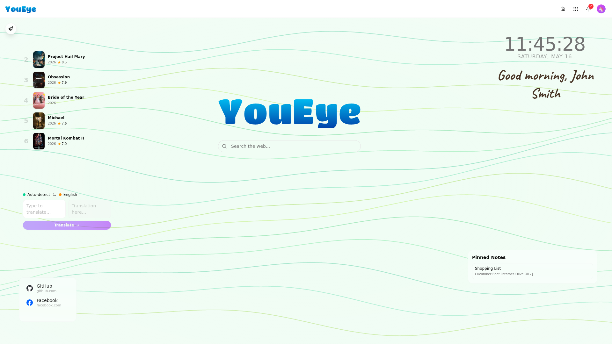
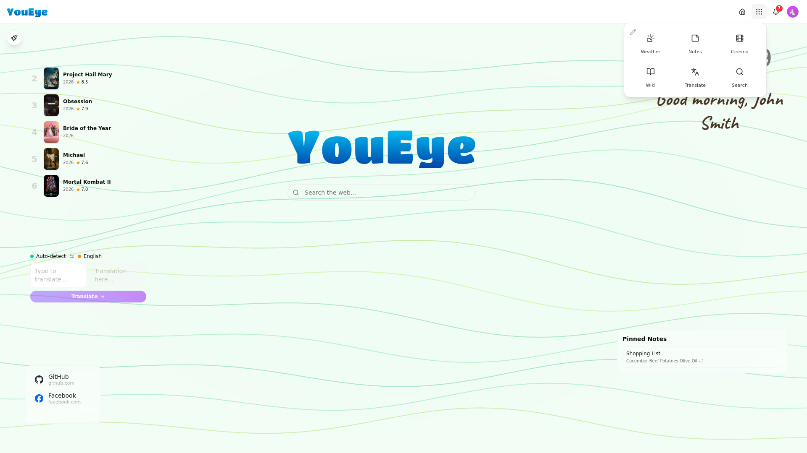
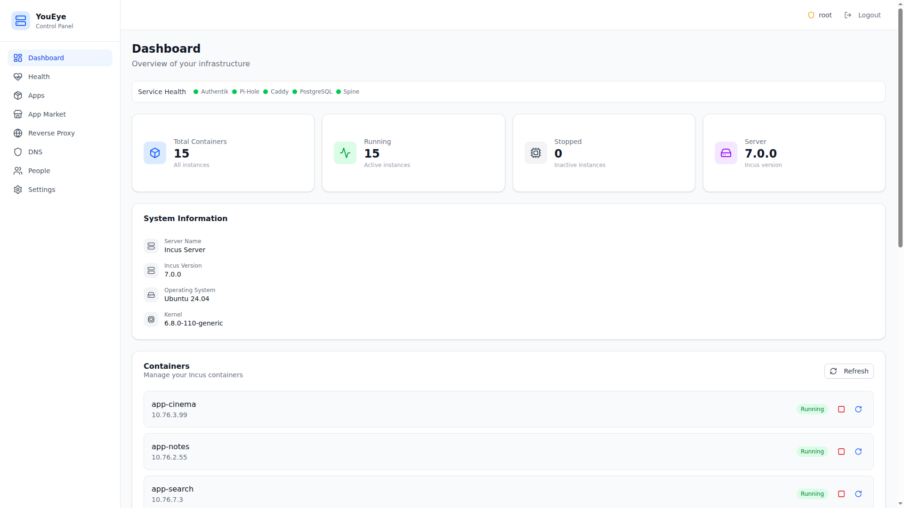
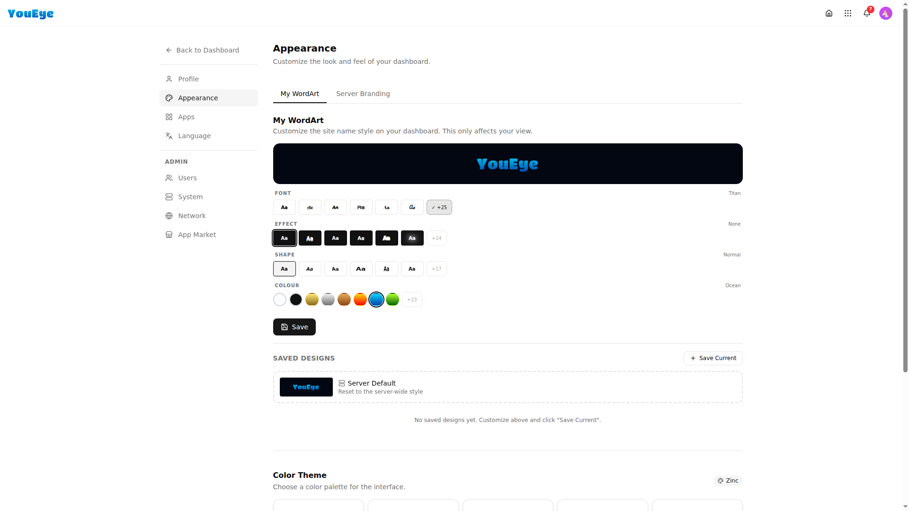
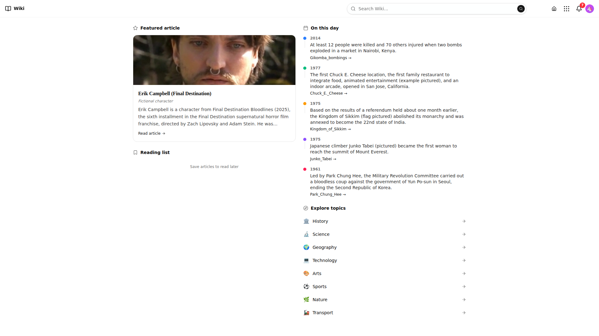
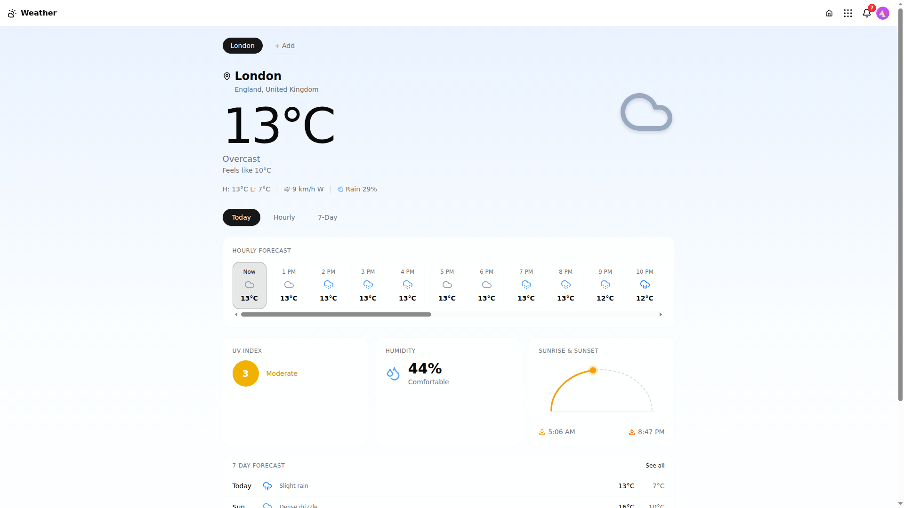

# YouEye

**Self-hosted personal cloud that feels like a consumer product.**

> **Not so public beta** - YouEye is under active development. Breaking changes can and will occur between releases. APIs, configuration formats, and database schemas may change without migration paths. Back up your data before upgrading.

One command installs a full platform: dashboard with widgets, six native apps, SSO, reverse proxy, DNS, and an app marketplace. Runs on a Debian/Ubuntu server or in a Debian VM created automatically on Proxmox VE.

<p align="center">
  
</p>

## Quick Start

```bash
curl -fsSL https://raw.githubusercontent.com/youeye-platform/YouEye/main/installer/scripts/install.sh | sudo bash -s --
```

The bootstrap downloads the latest released `youeye-installer` binary, then the installer detects Proxmox or base Linux, installs YouEye, and shows progress in the terminal. When it finishes, open `https://your-server-ip` in your browser and create your account.

> Requires a fresh Debian 12+ or Ubuntu 24.04+ system with root access, or a Proxmox VE host for the VM installer. See [full install guide](docs/getting-started.md) for Proxmox, silent installs, and manual setup.

## Features

| | |
|---|---|
| **Dashboard** | Customizable home screen with drag-and-drop widgets (clock, weather, notes, bookmarks, search, word art, and more) |
| **Native Apps** | Six built-in apps: Wiki, Search, Notes, Cinema, Weather, Translate |
| **Market** | Install apps and future add-ons from trusted catalogs with one click |
| **Single Sign-On** | YouEye ID powers SSO across all apps and services |
| **Themes** | OKLCH color system with light/dark mode and animated backgrounds |
| **Internationalization** | Full i18n support with language propagation across all apps |
| **Reverse Proxy** | Caddy with automatic HTTPS and domain routing |
| **DNS Filtering** | Pi-Hole integration for network-wide ad blocking |
| **Backups** | Multi-container backup engine with scheduled snapshots |
| **PWA** | Install as a Progressive Web App on any device |

### Screenshots

<table>
  <tr>
    <td></td>
    <td></td>
  </tr>
  <tr>
    <td align="center"><em>Dashboard with widgets</em></td>
    <td align="center"><em>App drawer</em></td>
  </tr>
  <tr>
    <td></td>
    <td></td>
  </tr>
  <tr>
    <td align="center"><em>Control Panel</em></td>
    <td align="center"><em>Theme customization</em></td>
  </tr>
  <tr>
    <td></td>
    <td></td>
  </tr>
  <tr>
    <td align="center"><em>Wiki app</em></td>
    <td align="center"><em>Weather app</em></td>
  </tr>
</table>

> See [full documentation](docs/) for more screenshots and detailed guides.

## Architecture


```mermaid
graph TD
    User[User Browser] -->|HTTPS| Caddy

    subgraph Host["Host (Debian/Ubuntu)"]
        Spine["youeye CLI (Spine)"]
    end

    Spine -->|manages| Container

    subgraph Container["Unprivileged Container (Incus)"]
        CP[Control Panel]
        Caddy[Caddy - Reverse Proxy]
        ID[YouEye ID]
        DB[(PostgreSQL 17)]
        DNS[Pi-Hole v6 - DNS]
        UI[YouEye UI]
        Apps[Native Apps]
    end

    Caddy --> UI
    Caddy --> Apps
    Caddy --> CP
    CP --> DB
    CP --> ID
    CP --> DNS
    UI --> DB
```

**Spine** is a Go binary that bootstraps the entire stack. It installs Incus, creates an unprivileged container, deploys the Control Panel inside it, and then gets out of the way. The Control Panel orchestrates everything else: database, YouEye ID, reverse proxy, DNS, the UI, and all apps.

> See [Architecture docs](docs/architecture.md) for the full security model and data flow diagrams.

## Tech Stack

| Component | Stack |
|-----------|-------|
| **Spine** | Go 1.21+, Cobra CLI, Bubble Tea TUI, Unix socket API |
| **Control Panel** | Next.js 16, TypeScript, Incus API, YouEye ID |
| **UI** | Next.js 15, Drizzle ORM, Radix UI, DND-Kit, Framer Motion |
| **Native Apps** | Next.js 15 |
| **Infrastructure** | Incus (LXD), PostgreSQL 17, YouEye ID, Caddy, Pi-Hole v6 |

## Native Apps

Six apps ship with the platform, each running in its own container with full SSO integration:

| App | Description |
|-----|-------------|
| **Wiki** | Wikipedia-style article browser with infobox parsing, search, and reading lists |
| **Search** | Unified search across all platform apps and services |
| **Notes** | Card-based note-taking with tags, checklists, reminders, and dashboard widgets |
| **Cinema** | Movie and TV discovery powered by TMDB with watchlists and sharing |
| **Weather** | Multi-location weather with Open-Meteo, forecasts, and dashboard widgets |
| **Translate** | Privacy-friendly translation with history, bookmarks, and auto-detect |

Each app provides dashboard widgets and integrates with the platform's theme, language, and notification systems. See [Apps documentation](docs/apps.md) for screenshots and details.

## Monorepo Structure

This repository contains the three core components:

| Directory | Component | Description |
|-----------|-----------|-------------|
| `spine/` | [Spine](spine/) | Go CLI that bootstraps and manages the platform |
| `control-panel/` | [Control Panel](control-panel/) | Next.js orchestration engine for all infrastructure |
| `ui/` | [UI](ui/) | Next.js user-facing dashboard with widgets and themes |

Each component is versioned and released independently.

## Current Versions

| Component | Version |
|-----------|---------|
| Spine | 0.4.11 (`spine-v0.4.11`) |
| Installer | 0.1.0 (`installer-v0.1.0`) |
| Control Panel | 0.4.51 (`cp-v0.4.51`) |
| UI | 0.4.32 (`ui-v0.4.32`) |
| Canvas | 0.3.2 (`v0.3.2`) |
| Wiki | 0.4.8 (`v0.4.8`) |
| Search | 0.4.8 (`v0.4.8`) |
| Notes | 0.4.9 (`v0.4.9`) |
| Cinema | 0.4.8 (`v0.4.8`) |
| Weather | 0.4.7 (`v0.4.7`) |
| Translate | 0.4.8 (`v0.4.8`) |

## Related Repositories

| Repository | Description |
|------------|-------------|
| [Market](https://github.com/youeye-platform/Market) | App marketplace catalog (YAML manifests) |
| [Wiki](https://github.com/youeye-platform/Wiki) | Wiki native app |
| [Search](https://github.com/youeye-platform/Search) | Search native app |
| [Notes](https://github.com/youeye-platform/Notes) | Notes native app |
| [Cinema](https://github.com/youeye-platform/Cinema) | Cinema native app |
| [Weather](https://github.com/youeye-platform/Weather) | Weather native app |
| [Translate](https://github.com/youeye-platform/Translate) | Translate native app |

## Documentation

Full documentation lives in the [`docs/`](docs/) folder:

- [Getting Started](docs/getting-started.md) — Installation, first login, CLI commands
- [Dashboard](docs/dashboard.md) — Widgets, backgrounds, edit mode
- [Apps](docs/apps.md) — Native apps and marketplace
- [Settings](docs/settings.md) — All configuration options
- [Control Panel](docs/control-panel.md) — Infrastructure administration
- [Architecture](docs/architecture.md) — System design, security model, diagrams

## Install Options

### One-Line Install (recommended)

```bash
curl -fsSL https://raw.githubusercontent.com/youeye-platform/YouEye/main/installer/scripts/install.sh | sudo bash -s --
```

This downloads the latest `installer-v*` release asset from GitHub and launches `youeye-installer`. On Proxmox it creates a Debian VM and installs YouEye inside it; on base Debian/Ubuntu it installs YouEye directly on the host. The interactive installer defaults to GitHub core and Market releases on the `main` channel, with editable source fields under Advanced Options.

### Silent Install

```bash
curl -fsSL https://raw.githubusercontent.com/youeye-platform/YouEye/main/installer/scripts/install.sh | sudo bash -s -- --silent --yes
```

Automation can install another channel by selecting the installer binary channel before `bash` and the runtime release channel after `--`:

```bash
curl -fsSL https://raw.githubusercontent.com/youeye-platform/YouEye/main/installer/scripts/install.sh | sudo env INSTALLER_CHANNEL=dev bash -s -- --silent --yes --release-channel dev
```

Automation can also override the bootstrap and runtime release sources explicitly:

```bash
curl -fsSL <installer-script-url> | sudo env INSTALLER_REPO_URL=<installer-release-repo> INSTALLER_CHANNEL=<channel> bash -s -- \
  --silent --yes \
  --core-repo <core-release-repo> \
  --market-repo <market-repo> \
  --release-channel <channel>
```

### Manual Install

```bash
# Download Spine binary directly
curl -LO https://github.com/youeye-platform/YouEye/releases/download/spine-v0.4.1/spine-linux-amd64
chmod +x spine-linux-amd64
mv spine-linux-amd64 /usr/local/bin/youeye

# Deploy
youeye deploy
```

### Proxmox VE

Run the one-line installer on the Proxmox host. It creates a Debian VM, installs YouEye inside it, and leaves the Proxmox host itself clean.

## Platform Management

```bash
youeye status          # Full platform health check
youeye deploy          # Deploy the entire stack
youeye update self     # Update Spine
youeye update control  # Update Control Panel
youeye cleanup         # Clean uninstall
youeye branch set dev  # Switch release channel
```

## Development

```bash
# Spine (Go)
cd spine && go build ./cmd/youeye

# Control Panel (Next.js 16)
cd control-panel && pnpm install && pnpm dev

# UI (Next.js 15)
cd ui && pnpm install && pnpm dev
```

**Always use pnpm**, never npm. Branch from `dev`, never from `main`.

## Contributing

YouEye is in its **not so public beta**. Contributions are welcome, but expect breaking changes between releases.

1. Fork the repository
2. Create your branch from `dev`
3. Make your changes
4. Submit a pull request

## License

YouEye source code is licensed under the [Business Source License 1.1](LICENSE). After four years, each version converts to [AGPL-3.0](https://www.gnu.org/licenses/agpl-3.0.html).

The "YouEye" name and logo are trademarks. See [TRADEMARK.md](TRADEMARK.md) for usage guidelines.
