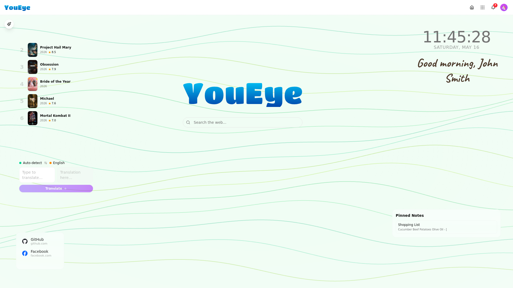

# YouEye Documentation

Welcome to the YouEye platform documentation. These guides cover installation, daily usage, administration, and architecture.

  

## Contents

| Guide | Description |
|-------|-------------|
| [Getting Started](getting-started.md) | Installation, first login, and initial setup |
| [Dashboard](dashboard.md) | Widgets, animated backgrounds, edit mode, and personalization |
| [Apps](apps.md) | Native apps, marketplace, and app management |
| [Settings](settings.md) | Profile, appearance, language, users, and system configuration |
| [Control Panel](control-panel.md) | Infrastructure management, health monitoring, and DNS |
| [Architecture](architecture.md) | System design, security model, and component overview |
| [Telemetry](telemetry.md) | Anonymous usage tracking for beta testing (temporary) |

## Screenshots

Dashboard & Navigation

| | |
|---|---|
|  |  |
| Dashboard with widgets | App drawer |
|  |  |
| Notifications panel | Widget edit mode |

Native Apps

| | |
|---|---|
|  |  |
| Wiki | Search |
|  |  |
| Notes | Cinema |
|  |  |
| Weather | Translate |

Control Panel

| | |
|---|---|
|  |  |
| Dashboard | Health monitoring |
|  |  |
| App management | DNS filtering |

## Quick Links

- [Install YouEye](getting-started.md#installation) — one command, ~5 minutes
- [Add widgets to your dashboard](dashboard.md#adding-widgets)
- [Install apps from the marketplace](apps.md#marketplace)
- [Manage users](settings.md#users)
- [Monitor system health](control-panel.md#health-monitoring)
