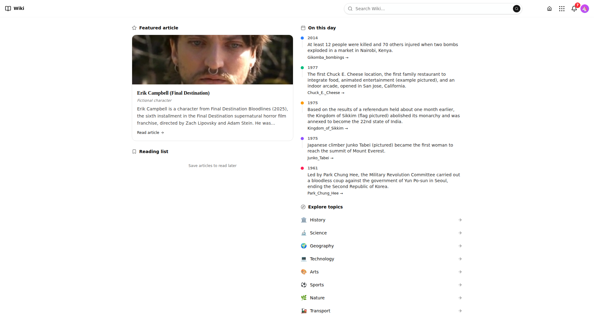
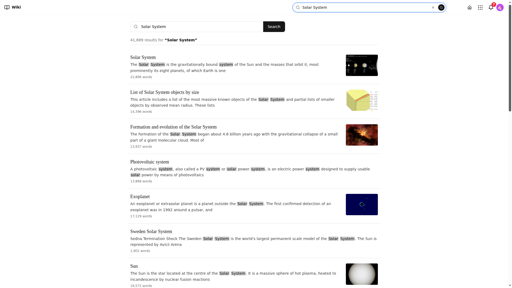
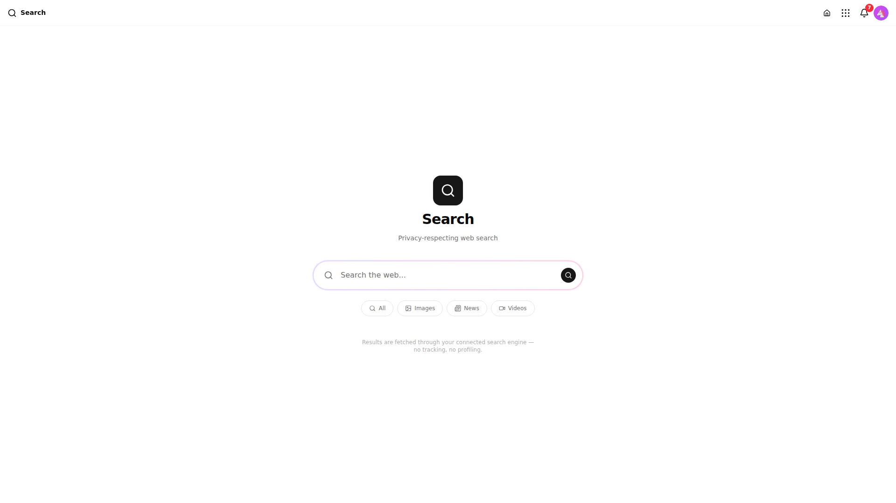
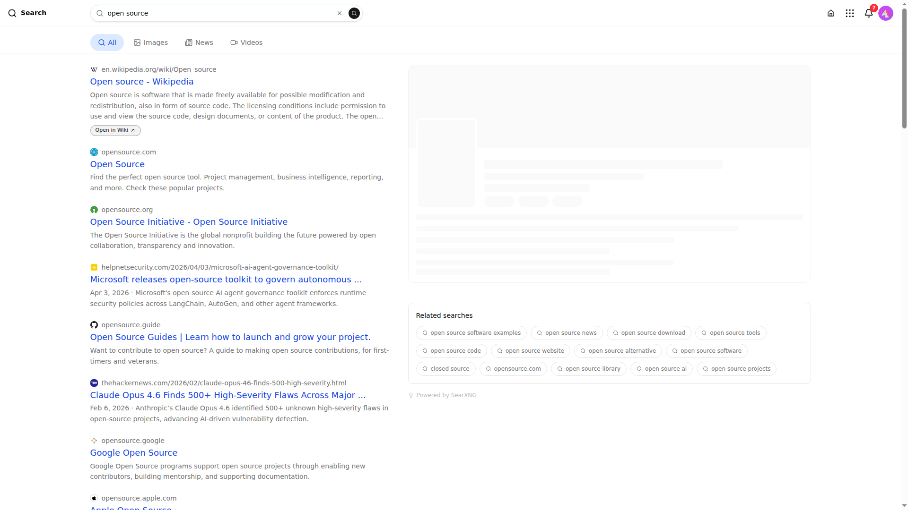
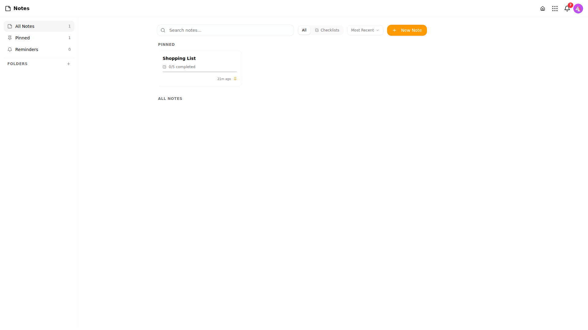
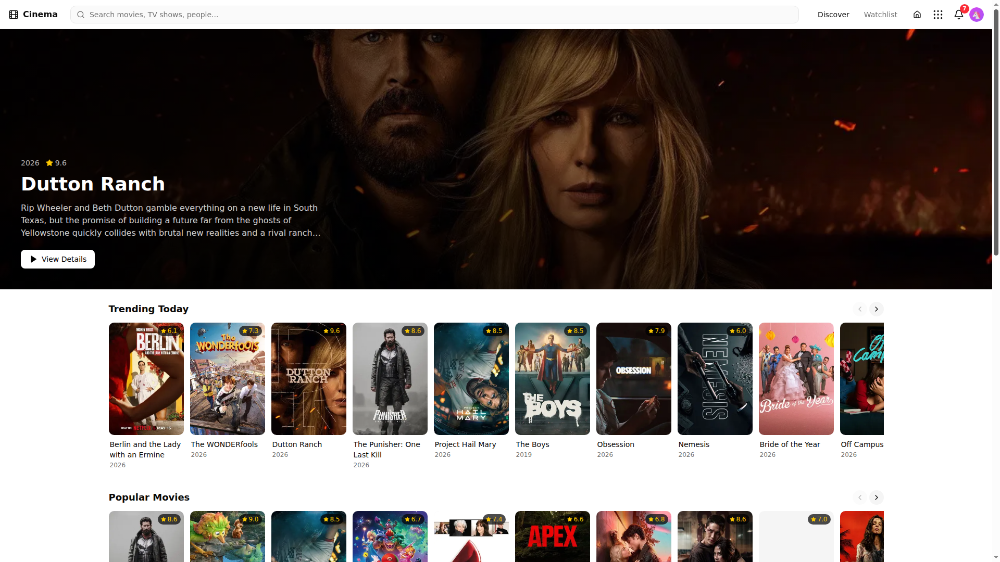
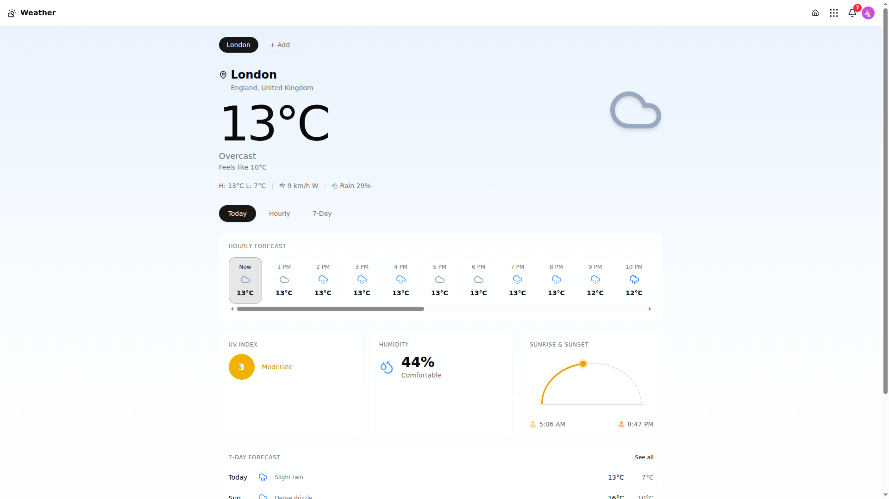
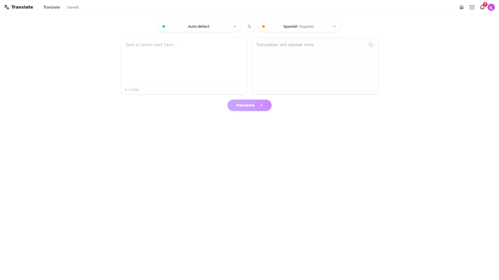
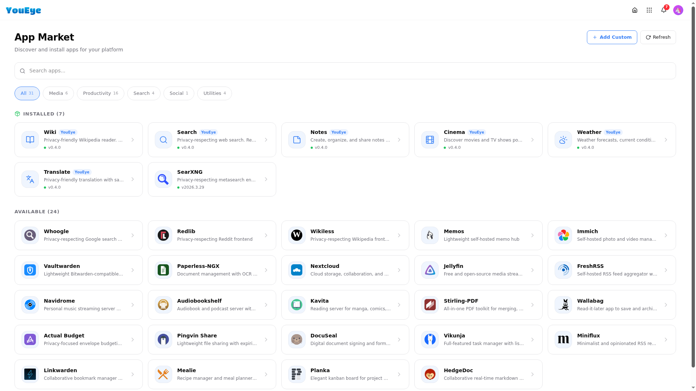
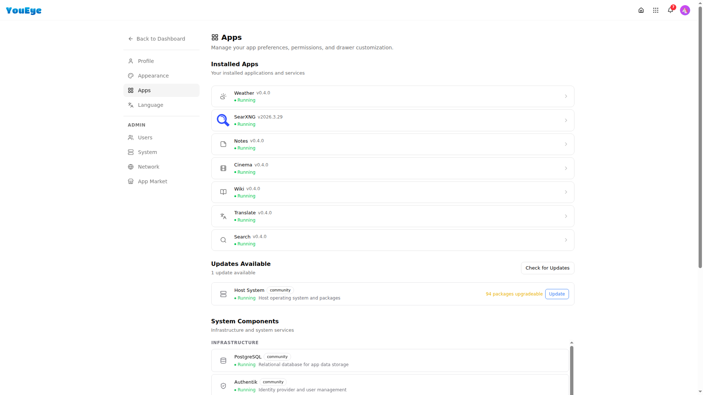

# Apps

YouEye ships with six native apps and a marketplace for installing more. Every app runs in its own container with full SSO integration — sign in once, access everything.

## Native Apps

### Wiki

A Wikipedia-style article browser with full-text search, infobox parsing, and reading lists.

| | |
|---|---|
|  |  |
| Featured articles and categories | Article with parsed infobox |

**Features:**
- Browse and search Wikipedia articles
- Parsed infoboxes with structured data
- Reading lists for saving articles
- Full-text search with instant results
- Dashboard widget for quick access

---

### Search

Unified search across all platform apps and services.

| | |
|---|---|
|  |  |
| Search home | Results across apps |

**Features:**
- Search across all installed apps from one place
- Instant results with source indicators
- Keyboard-friendly navigation
- Dashboard widget for quick searches

---

### Notes

Card-based note-taking with tags, checklists, and reminders.

  

**Features:**
- Create notes with rich text, checklists, and tags
- Color-coded cards for visual organization
- Pin important notes to the top
- Reminders with notifications
- Dashboard widget showing recent notes

---

### Cinema

Movie and TV discovery powered by TMDB with watchlists and sharing.

  

**Features:**
- Browse trending movies and TV shows
- Search the TMDB catalog
- Create watchlists
- View cast, crew, trailers, and ratings
- Share recommendations with other users

---

### Weather

Multi-location weather with detailed forecasts powered by Open-Meteo.

  

**Features:**
- Add multiple locations
- Current conditions with temperature, humidity, wind, and UV index
- Hourly and daily forecasts
- Sunrise/sunset times
- Dashboard widget showing current conditions

---

### Translate

Privacy-friendly translation with history and bookmarks.

  

**Features:**
- Translate between 100+ languages
- Auto-detect source language
- Translation history
- Bookmark frequent translations
- Dashboard widget for quick translations

---

## Marketplace

The App Marketplace lets you install third-party apps with one click. Available apps include productivity tools, media players, utilities, and more.

  

### Installing Apps

1. Open **Settings** → **App Market**
2. Browse or search available apps
3. Click **Install** on any app
4. The app is downloaded, configured, and deployed automatically
5. It appears in your app drawer immediately

### Managing Apps

Installed apps can be managed from **Settings** → **Apps**:

  

From here you can:
- View all installed apps
- Uninstall apps you no longer need
- Check app versions and update status

## App Integration

All apps — native and marketplace — share these platform features:

- **Single Sign-On** — One login works everywhere
- **Theming** — Apps inherit your chosen colors and dark/light mode
- **Language** — Apps follow your language preference
- **Notifications** — Apps can send notifications to the dashboard
- **Widgets** — Apps can provide dashboard widgets
- **Subdomain Routing** — Each app gets its own subdomain (e.g., `wiki.yourdomain.com`)
