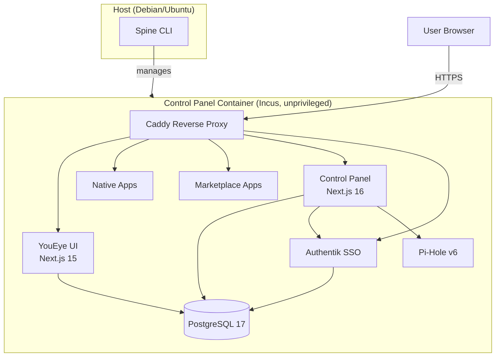
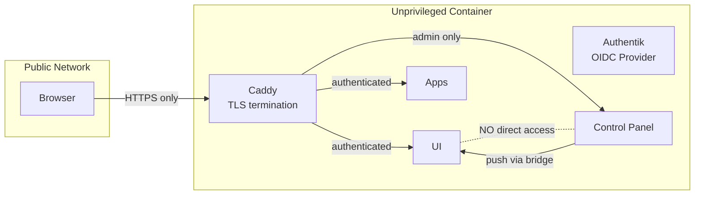
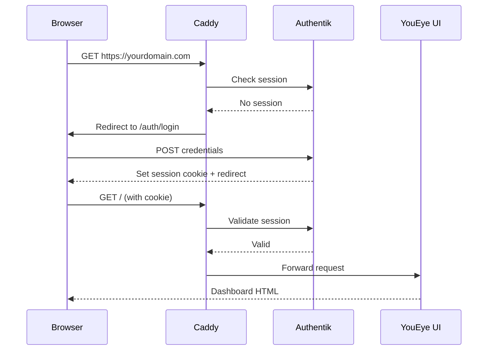
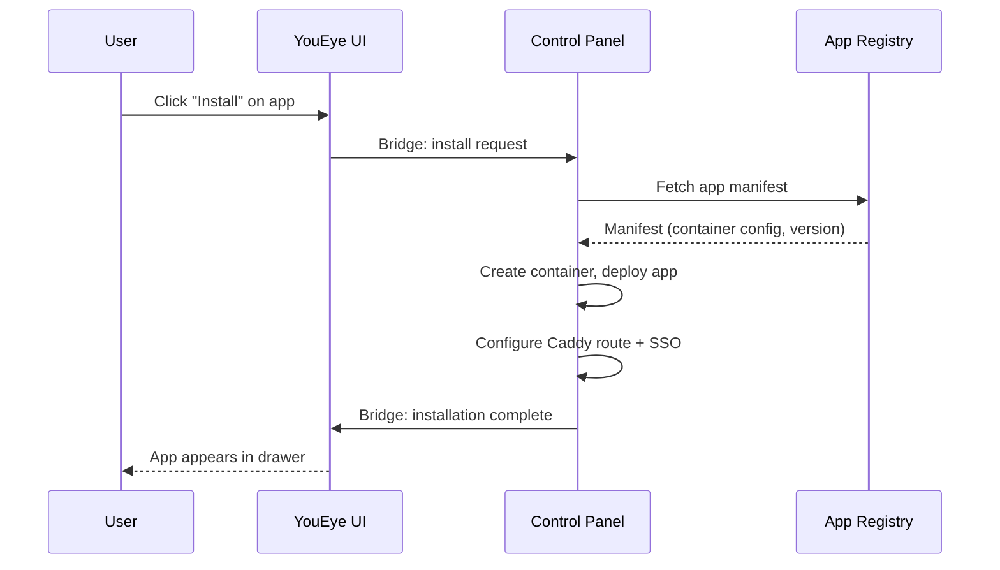
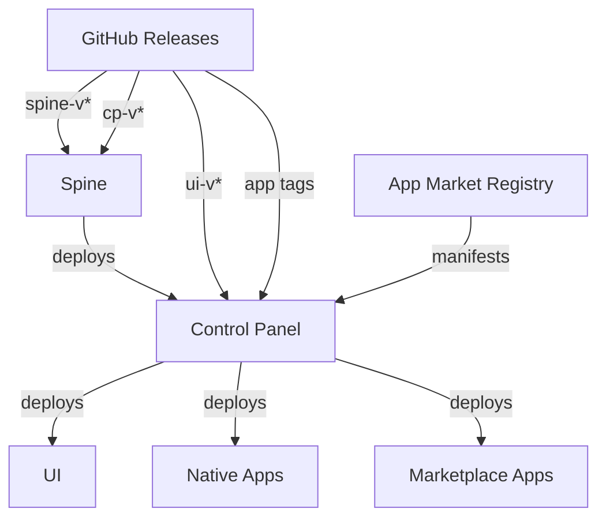

# Architecture

YouEye uses a layered architecture where each component has a single responsibility and clear boundaries.

## System Overview



## Component Boundaries

### Spine (Host)

Spine is a Go binary that runs on the host system. Its responsibilities are strictly limited:

- Install and manage Incus
- Create the unprivileged container
- Deploy the Control Panel into the container
- Update itself and the Control Panel
- Report platform status

**Spine does NOT manage** the UI, native apps, marketplace apps, or any infrastructure inside the container. That's the Control Panel's job.

### Control Panel (Container)

The Control Panel is the orchestration engine. It manages everything inside the container:

- PostgreSQL database
- Authentik (SSO/OIDC)
- Caddy (reverse proxy, TLS)
- Pi-Hole (DNS)
- YouEye UI deployment
- Native app deployment
- Marketplace app lifecycle

### UI (Container)

The UI is the user-facing dashboard. It provides:

- Widget management (drag, drop, resize)
- Theme and appearance engine
- User settings
- App drawer and notifications
- Bridge API endpoints for CP communication

### Native Apps (Container)

Each native app runs as its own process with:

- Its own subdomain route via Caddy
- SSO integration via Authentik
- Access to the shared PostgreSQL database
- Theme and language synchronization with the UI

## Security Model



Key security principles:

| Principle | Implementation |
|-----------|---------------|
| **Unprivileged container** | The entire stack runs in an unprivileged Incus container — no root on the host |
| **Single entry point** | All traffic enters through Caddy (port 443 only) |
| **Automatic TLS** | Caddy provisions and renews certificates automatically |
| **SSO everywhere** | Authentik gates every app and service — no separate logins |
| **One-way bridge** | CP pushes data to UI via bridge API; UI cannot call CP |
| **Network isolation** | UI container is firewalled from reaching CP directly |

## Data Flow

### User Authentication



### App Installation



## Tech Stack

| Component | Technology | Purpose |
|-----------|-----------|---------|
| **Spine** | Go 1.21+, Cobra, Bubble Tea | Host-level CLI and TUI installer |
| **Control Panel** | Next.js 16, TypeScript | Infrastructure orchestration |
| **UI** | Next.js 15, Drizzle ORM, Radix UI, DND-Kit, Framer Motion | User dashboard |
| **Native Apps** | Next.js 15 | Wiki, Search, Notes, Cinema, Weather, Translate |
| **Database** | PostgreSQL 17 | Shared data store |
| **SSO** | Authentik | OIDC identity provider |
| **Proxy** | Caddy | Reverse proxy with automatic HTTPS |
| **DNS** | Pi-Hole v6 | DNS filtering and local resolution |
| **Containers** | Incus (LXD fork) | Lightweight system containers |

## Monorepo Structure

```
YouEye/
├── spine/              # Go CLI (Spine)
│   ├── cmd/            # CLI entry point
│   ├── internal/       # Commands, config, TUI
│   └── install.sh      # One-line installer script
├── control-panel/      # Next.js 16 (Control Panel)
│   ├── src/            # Application source
│   ├── prisma/         # Database schema (unused, legacy)
│   └── package.json
├── ui/                 # Next.js 15 (Dashboard UI)
│   ├── src/            # Application source
│   ├── drizzle/        # Database migrations
│   └── package.json
└── docs/               # This documentation
```

Each component is **versioned independently** and released with its own tag prefix (`spine-v*`, `cp-v*`, `ui-v*`).

## Update System

Spine manages updates for itself and the Control Panel. The Control Panel manages updates for everything else.



Updates are pulled from GitHub releases. Each component checks for newer tags matching its prefix and branch, downloads the artifact, and deploys it.
