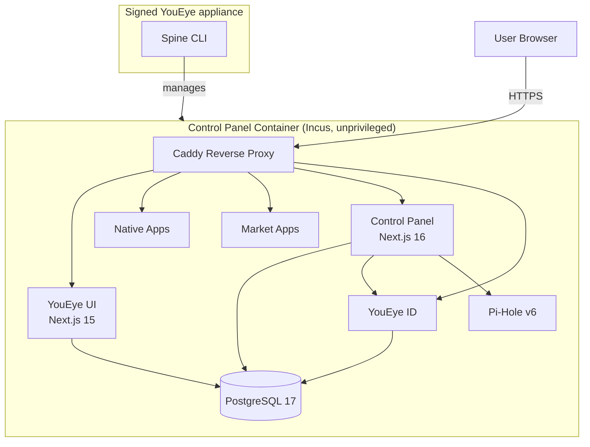
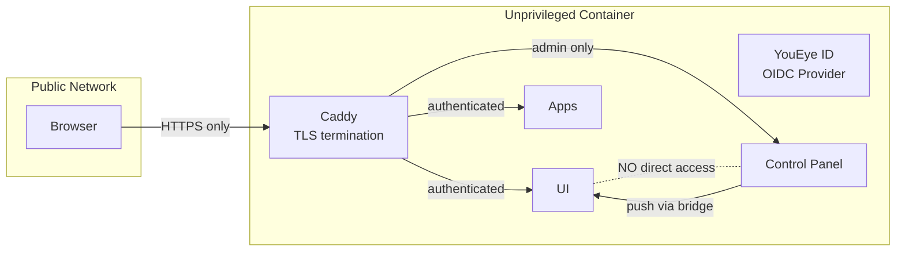
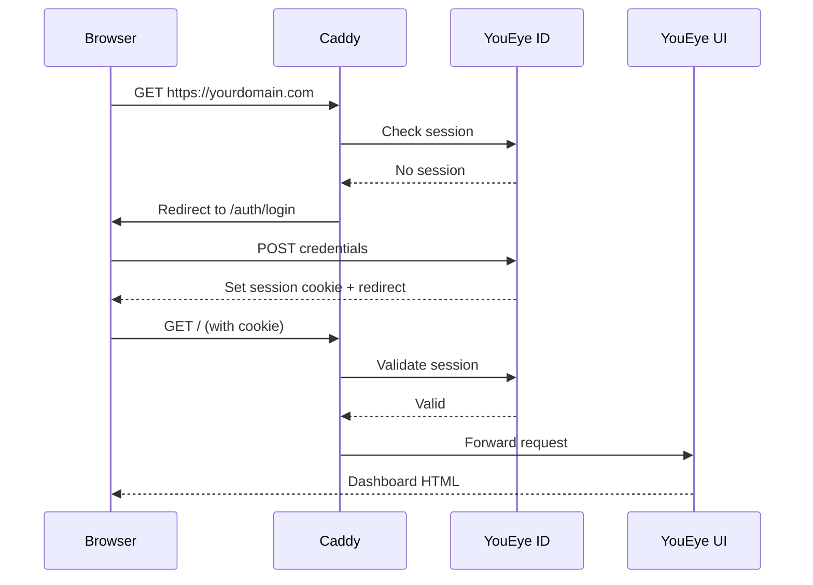
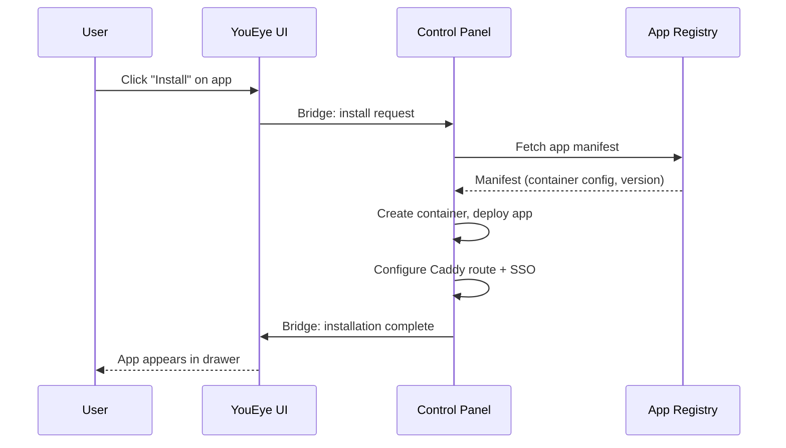
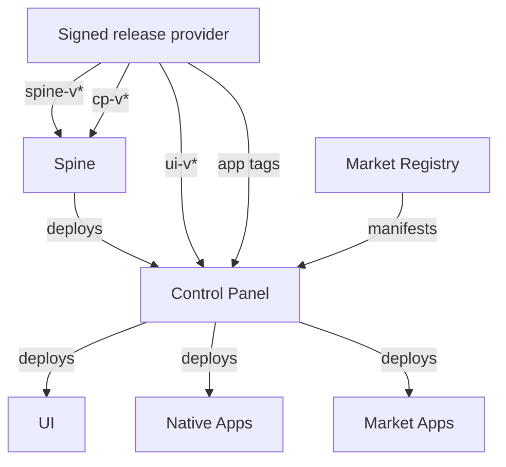

# Architecture

YouEye uses a layered architecture where each component has a single responsibility and clear boundaries.

## System Overview


```mermaid
graph TD
    User[User Browser] -->|HTTPS| Caddy[Caddy Reverse Proxy]
    
    subgraph Host["Signed YouEye appliance"]
        Spine[Spine CLI]
    end
    
    Spine -->|manages| Container
    
    subgraph Container["Control Panel Container (Incus, unprivileged)"]
        CP[Control Panel<br/>Next.js 16]
        Caddy
        ID[YouEye ID]
        DB[(PostgreSQL 17)]
        DNS[Pi-Hole v6]
        UI[YouEye UI<br/>Next.js 15]
        Apps[Native Apps]
        Market[Market Apps]
    end
    
    Caddy --> UI
    Caddy --> Apps
    Caddy --> Market
    Caddy --> CP
    Caddy --> ID
    
    CP --> DB
    CP --> ID
    CP --> DNS
    UI --> DB
    ID --> DB
```

## Component Boundaries

### Spine (Host)

Spine is a Go binary that runs on the host system. Its responsibilities are strictly limited:

- Install and manage Incus
- Create the unprivileged container
- Deploy the Control Panel into the container
- Update itself and the Control Panel
- Report platform status

**Spine does NOT manage** the UI, native apps, Market-installed apps, or any infrastructure inside the container. That's the Control Panel's job.

### Control Panel (Container)

The Control Panel is the orchestration engine. It manages everything inside the container:

- PostgreSQL database
- YouEye ID (SSO/OIDC)
- Caddy (reverse proxy, TLS)
- Pi-Hole (DNS)
- YouEye UI deployment
- Native app deployment
- Market app lifecycle

### UI (Container)

The UI is the user-facing dashboard. It provides:

- Widget management (drag, drop, resize)
- Theme and appearance engine
- User settings
- App drawer and notifications
- Bridge API endpoints for CP communication

### Native Apps (Container)

Each native app runs as its own process with:

- Its own subdomain route via Caddy
- SSO integration via YouEye ID
- Access to the shared PostgreSQL database
- Theme and language synchronization with the UI

## Security Model


```mermaid
graph LR
    subgraph Public["Public Network"]
        Browser[Browser]
    end
    
    subgraph Container["Unprivileged Container"]
        Caddy[Caddy<br/>TLS termination]
        ID[YouEye ID<br/>OIDC Provider]
        UI[UI]
        CP[Control Panel]
        Apps[Apps]
    end
    
    Browser -->|HTTPS only| Caddy
    Caddy -->|authenticated| UI
    Caddy -->|authenticated| Apps
    Caddy -->|admin only| CP
    
    UI -.-|"NO direct access"| CP
    CP -->|push via bridge| UI
```

Key security principles:

| Principle | Implementation |
|-----------|---------------|
| **Unprivileged container** | The entire stack runs in an unprivileged Incus container — no root on the host |
| **Single entry point** | All traffic enters through Caddy (port 443 only) |
| **Automatic TLS** | Caddy provisions and renews certificates automatically |
| **SSO everywhere** | YouEye ID gates apps and services - no separate logins |
| **One-way bridge** | CP pushes data to UI via bridge API; UI cannot call CP |
| **Network isolation** | UI container is firewalled from reaching CP directly |

## Data Flow

### User Authentication


```mermaid
sequenceDiagram
    participant B as Browser
    participant C as Caddy
    participant A as YouEye ID
    participant UI as YouEye UI
    
    B->>C: GET https://yourdomain.com
    C->>A: Check session
    A-->>C: No session
    C->>B: Redirect to /auth/login
    B->>A: POST credentials
    A-->>B: Set session cookie + redirect
    B->>C: GET / (with cookie)
    C->>A: Validate session
    A-->>C: Valid
    C->>UI: Forward request
    UI-->>B: Dashboard HTML
```

### App Installation


```mermaid
sequenceDiagram
    participant U as User
    participant UI as YouEye UI
    participant CP as Control Panel
    participant R as App Registry
    
    U->>UI: Click "Install" on app
    UI->>CP: Bridge: install request
    CP->>R: Fetch app manifest
    R-->>CP: Manifest (container config, version)
    CP->>CP: Create container, deploy app
    CP->>CP: Configure Caddy route + SSO
    CP->>UI: Bridge: installation complete
    UI-->>U: App appears in drawer
```

## Tech Stack

| Component | Technology | Purpose |
|-----------|-----------|---------|
| **Spine** | Go 1.21+, Cobra, Bubble Tea | Host lifecycle and signed-release manager |
| **Installer** | Go, Bubble Tea | Signed ISO and Proxmox installation flows |
| **Control Panel** | Next.js 16, TypeScript | Infrastructure orchestration |
| **UI** | Next.js 15, Drizzle ORM, Radix UI, DND-Kit, Framer Motion | User dashboard |
| **Native Apps** | Next.js 15 | Wiki, Search, Notes, Cinema, Weather, Translate |
| **Database** | PostgreSQL 17 | Shared data store |
| **SSO** | YouEye ID | OIDC identity provider |
| **Proxy** | Caddy | Reverse proxy with automatic HTTPS |
| **DNS** | Pi-Hole v6 | DNS filtering and local resolution |
| **Containers** | Incus (LXD fork) | Lightweight system containers |

## Monorepo Structure

```
YouEye/
├── installer/          # YouEye Installer binary and Proxmox bootstrap
├── appliance/          # Signed A/B/Recovery image lifecycle
├── spine/              # Go CLI (Spine)
│   ├── cmd/            # CLI entry point
│   └── internal/       # Commands, config, release and lifecycle services
├── control-panel/      # Next.js 16 (Control Panel)
│   ├── src/            # Application source
│   ├── prisma/         # Database schema (unused, legacy)
│   └── package.json
├── ui/                 # Next.js 15 (Dashboard UI)
│   ├── src/            # Application source
│   ├── drizzle/        # Database migrations
│   └── package.json
└── docs/               # This documentation
```

Each component is **versioned independently** and released with its own tag prefix (`spine-v*`, `cp-v*`, `ui-v*`).

## Update System

Spine manages updates for itself and the Control Panel. The Control Panel manages updates for everything else.


```mermaid
graph TD
    F[Signed release provider] -->|spine-v*| Spine
    F -->|cp-v*| Spine
    Spine -->|deploys| CP[Control Panel]
    
    F -->|ui-v*| CP
    F -->|app tags| CP
    CP -->|deploys| UI[UI]
    CP -->|deploys| Apps[Native Apps]
    
    Registry[Market Registry] -->|manifests| CP
    CP -->|deploys| MarketApps[Market Apps]
```

Updates default to official GitHub Stable releases. An administrator may select
an explicit Forgejo or custom HTTPS source without changing distributed build
defaults. Each mutation requires signed checksum metadata, the exact artifact
digest, and any configured channel digest. Missing releases do not fall back
across channels.
