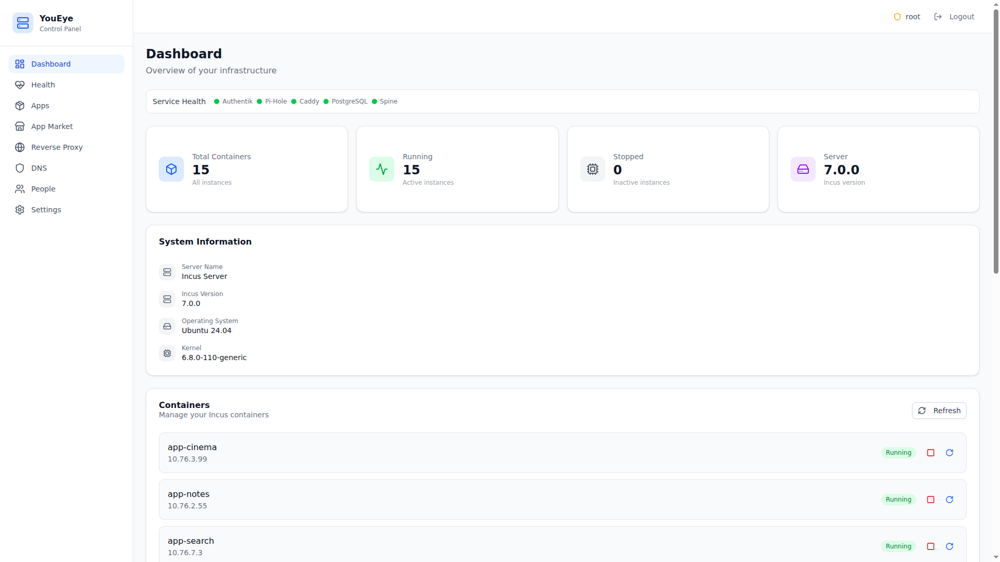
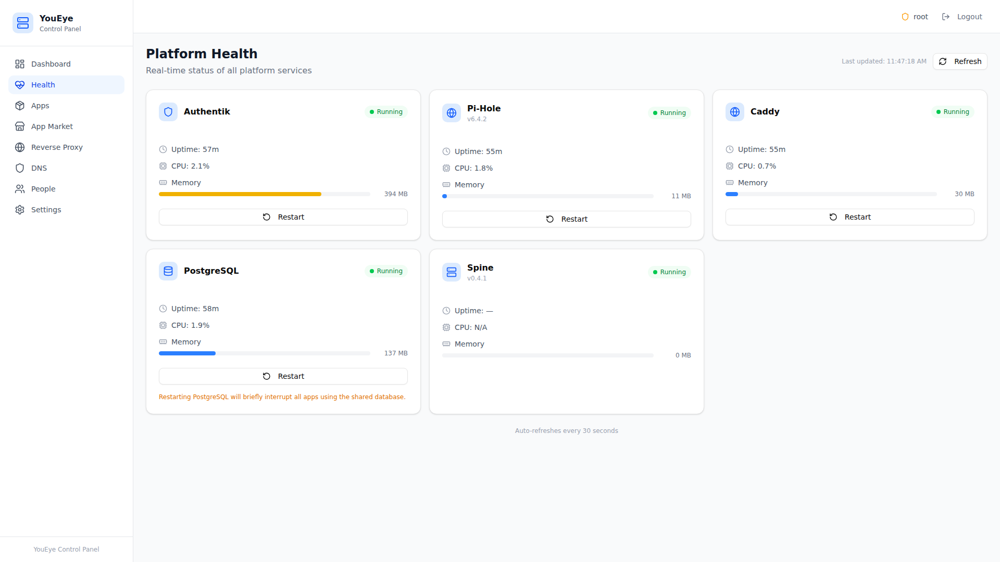
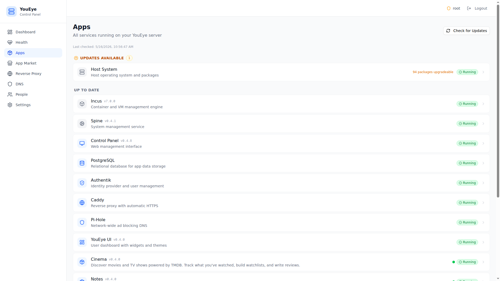
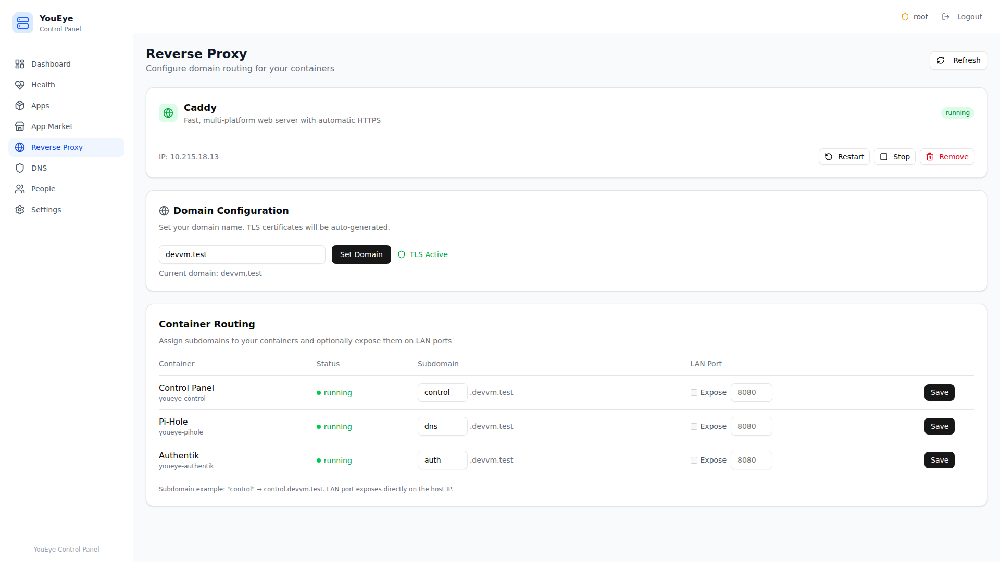
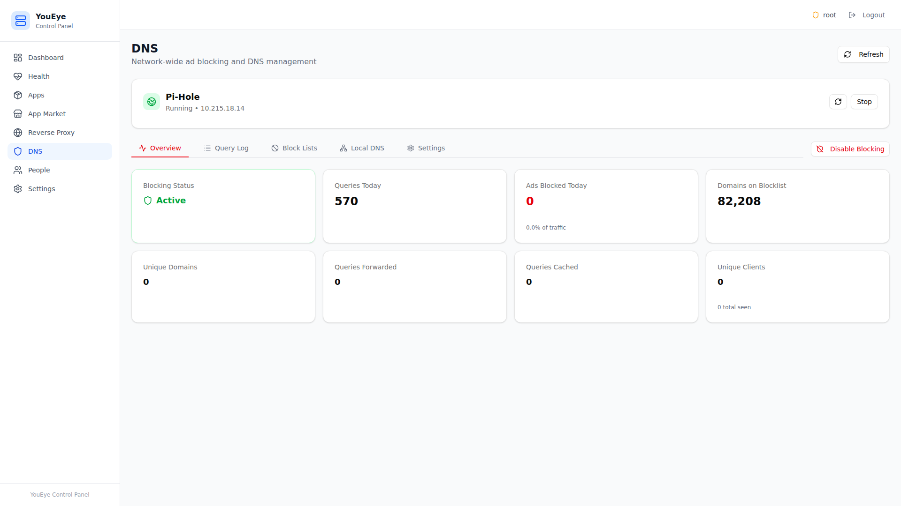
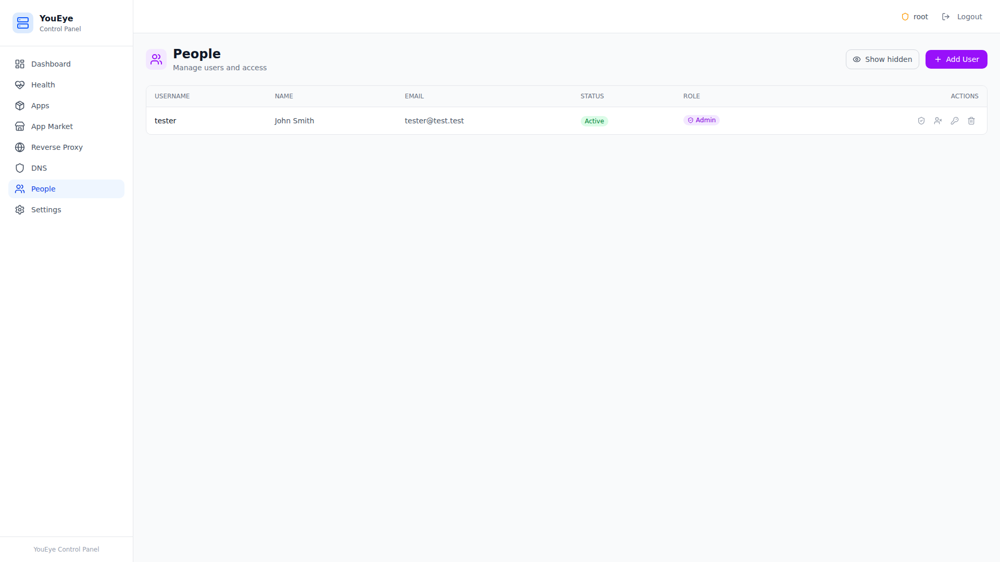
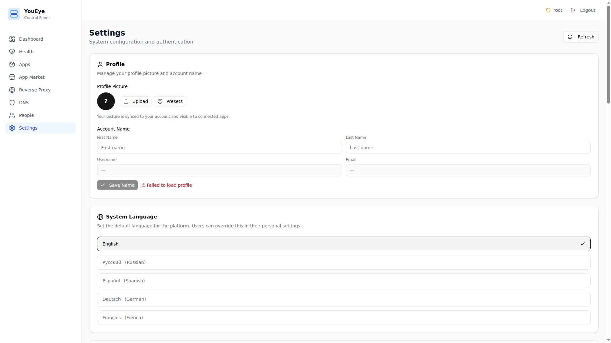
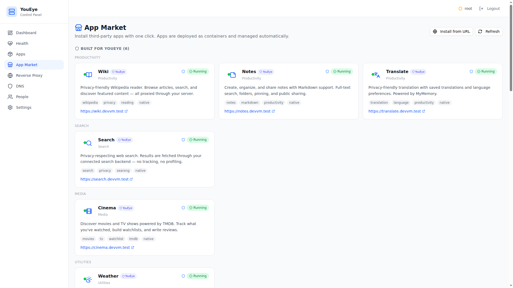

# Control Panel

The Control Panel is the infrastructure management interface for platform administrators. It runs at a separate URL from the user-facing dashboard and provides full visibility into system health, containers, networking, and apps.

> Access the Control Panel from the user dashboard via **Settings → System → Control Panel**, or navigate directly to its URL.

## Dashboard

  

The Control Panel dashboard shows:

- **System overview** — CPU, memory, and disk usage
- **Container status** — All running containers with health indicators
- **Quick actions** — Common operations (restart services, check updates)
- **Recent activity** — Latest platform events and changes

---

## Health Monitoring

  

Real-time health checks for every platform component:

- **Container health** — Running/stopped status for each container
- **Service health** — Individual service checks (database, SSO, proxy, DNS)
- **Resource usage** — CPU, memory, and disk per container
- **Uptime** — How long each service has been running

Health checks run continuously. Issues are flagged with colored indicators (green = healthy, yellow = warning, red = critical).

---

## App Management

  

Manage all deployed apps from the admin perspective:

- **View containers** — See every app's container, resource allocation, and status
- **Start/Stop** — Control individual app containers
- **Logs** — View container logs for debugging
- **Updates** — Deploy new app versions
- **Remove** — Uninstall apps and clean up their containers

---

## Reverse Proxy

  

Caddy reverse proxy configuration:

- **Routes** — View all configured domain routes and their targets
- **TLS** — Automatic HTTPS certificate management (on-demand TLS)
- **Subdomains** — Each app gets its own subdomain automatically
- **Custom routes** — Add manual proxy rules if needed

Caddy handles TLS automatically — certificates are provisioned on first request and renewed before expiry.

---

## DNS Filtering

  

Pi-Hole v6 integration for network-wide DNS filtering:

- **Query log** — See all DNS queries and their resolution status
- **Block lists** — Manage ad-blocking and tracking filter lists
- **Statistics** — Queries blocked, top domains, top clients
- **Local DNS** — Add custom DNS records for internal services

Pi-Hole provides ad blocking and DNS resolution for all containers on the platform network.

---

## People (SSO)

  

User and authentication management powered by Authentik:

- **Users** — View and manage all platform users
- **Groups** — Organize users into groups with shared permissions
- **Sessions** — View active sessions and revoke access
- **SSO Providers** — Configure OIDC/OAuth providers for apps

---

## Settings

  

Control Panel configuration:

- **General** — Platform name, domain, and branding
- **Updates** — Configure update channels and auto-update policies
- **Backups** — Multi-container backup engine with scheduling
- **Notifications** — Configure admin alerts and notification channels

---

## Marketplace (Admin View)

  

The admin marketplace view provides additional controls beyond what users see:

- **Catalog management** — View all available apps from the registry
- **Deploy options** — Configure resource limits and container settings per app
- **Version management** — Pin app versions or enable auto-updates
- **Registry sources** — Configure where app manifests are fetched from
