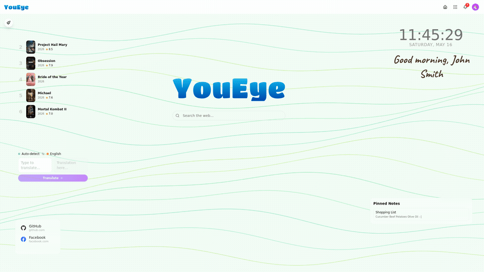
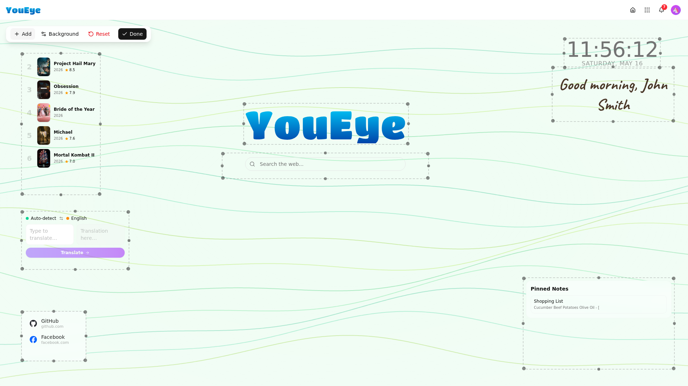
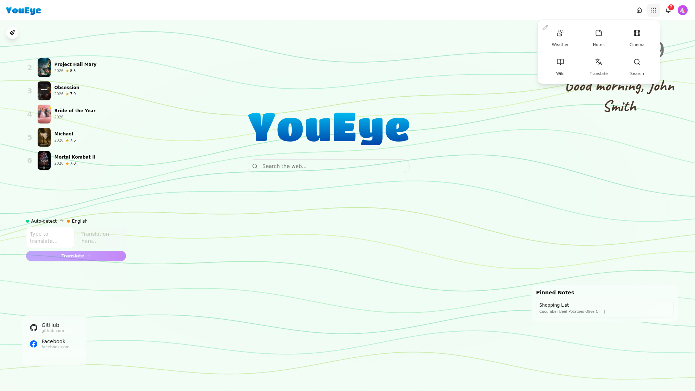
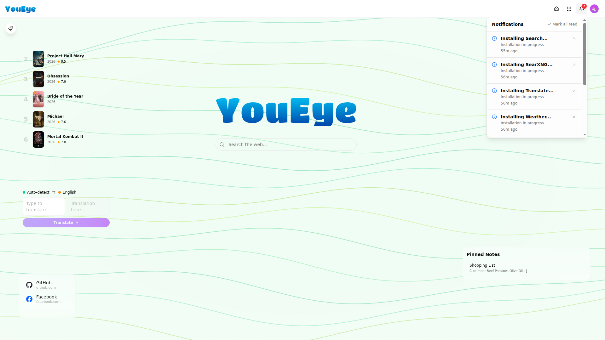
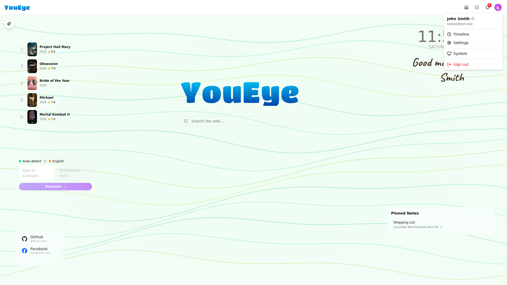

# Dashboard

The dashboard is your home screen — a customizable canvas with drag-and-drop widgets and animated backgrounds.

  

## Widgets

Widgets are interactive cards that live on your dashboard. Each widget can be moved, resized, and configured independently.

### Available Widgets

| Widget | Description |
|--------|-------------|
| **Clock** | Analog or digital clock with timezone support |
| **Weather** | Current conditions and forecast for your locations |
| **Notes** | Quick sticky notes pinned to the dashboard |
| **Bookmarks** | Link collections with icons and categories |
| **Search** | Search bar that queries across all platform apps |
| **Word Art** | Decorative text with custom fonts and styles |
| **Calendar** | Date display and upcoming events |
| **Stocks** | Stock ticker with live market data |

### Adding Widgets

1. Click the **pencil icon** in the top-right corner to enter edit mode
2. The widget palette appears at the bottom of the screen
3. Drag a widget from the palette onto the dashboard
4. Release to place it

  

### Moving and Resizing

In edit mode:
- **Drag** any widget to reposition it
- **Resize** by dragging the edges or corners
- Widgets snap to a grid for alignment
- Changes save automatically when you exit edit mode

### Widget Settings

Click the gear icon on any widget (visible in edit mode) to configure it. Options vary by widget type — for example, the weather widget lets you choose which location to display.

## Animated Backgrounds

YouEye includes animated shader backgrounds that respond to your theme colors. The background is generated in real-time using WebGL and follows your chosen color palette.

The animated background is visible in the GIF above — it creates a smooth, flowing gradient effect behind your widgets.

## Navigation

The top navigation bar provides quick access to platform features:

| Element | Location | Function |
|---------|----------|----------|
| **App Drawer** | Top-right (grid icon) | Opens the app launcher with all installed apps |
| **Notifications** | Top-right (bell icon) | Shows platform notifications and alerts |
| **User Menu** | Top-right (avatar) | Profile, settings, and sign out |

### App Drawer

  

The app drawer shows all installed apps as a grid of icons. Click any app to open it. Apps open in a new tab with full SSO — no additional login required.

### Notifications

  

The notification panel shows system alerts, app updates, and user notifications. Notifications are real-time and persist until dismissed.

### User Menu

  

The user menu provides access to:
- **Profile** — Edit your display name and avatar
- **Settings** — Full settings panel
- **Sign Out** — End your session

## PWA Support

YouEye can be installed as a Progressive Web App on any device. When visiting the dashboard in a mobile browser, use "Add to Home Screen" to get a native app-like experience with its own icon and full-screen mode.
