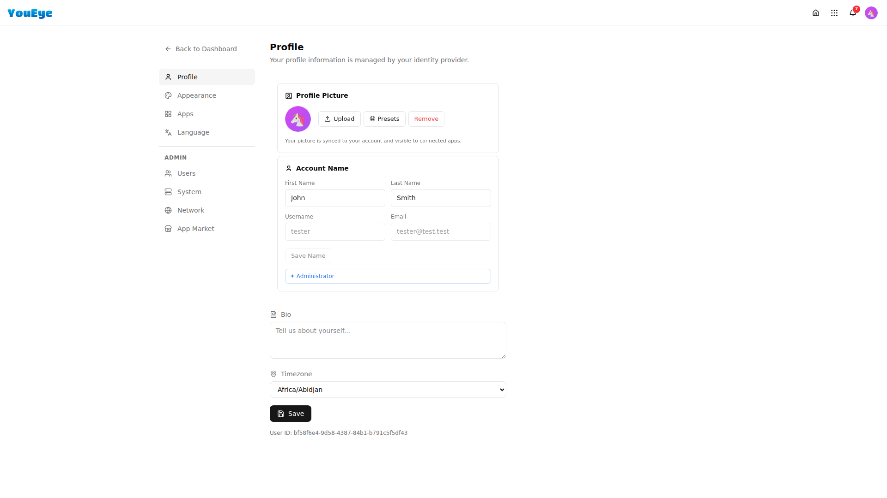
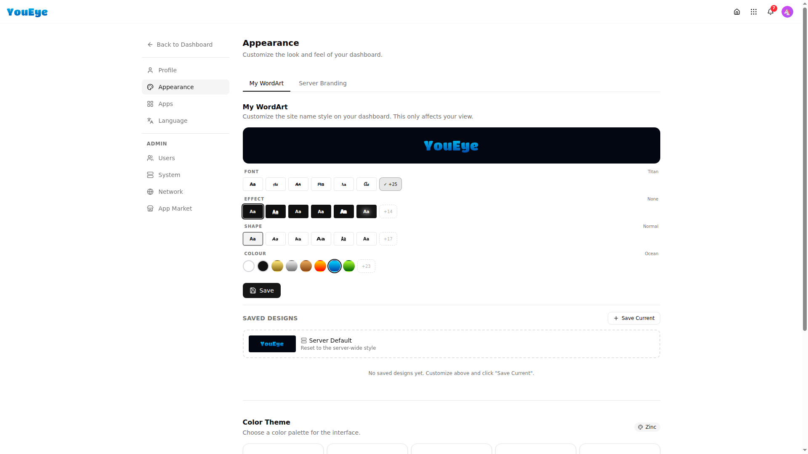
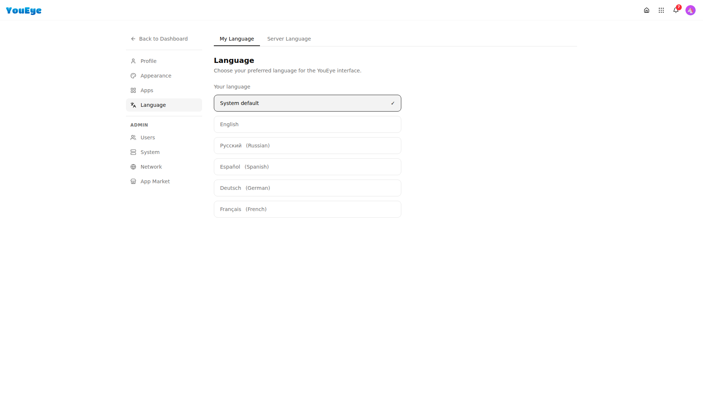
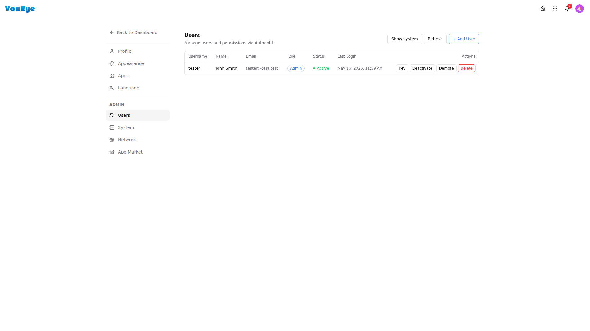
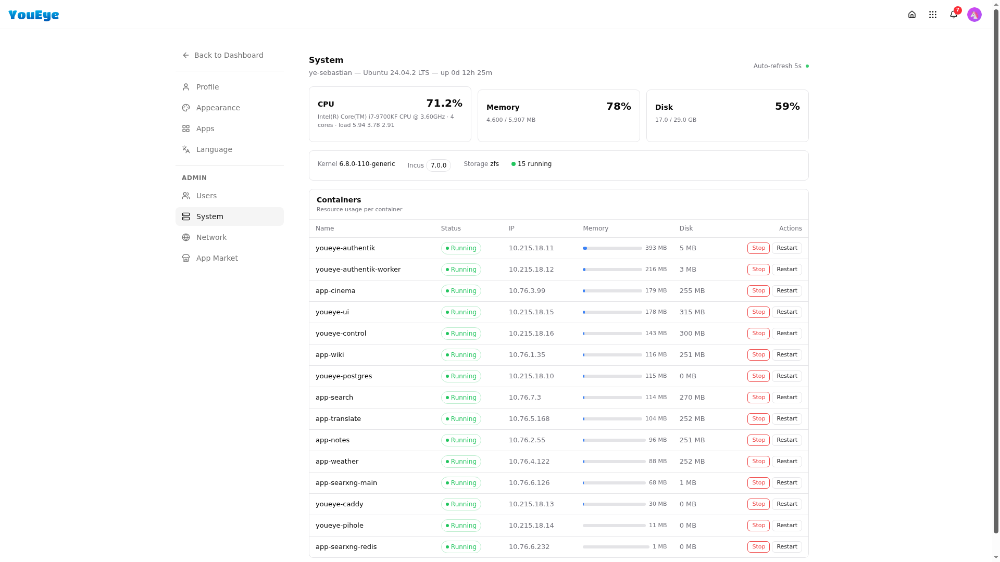
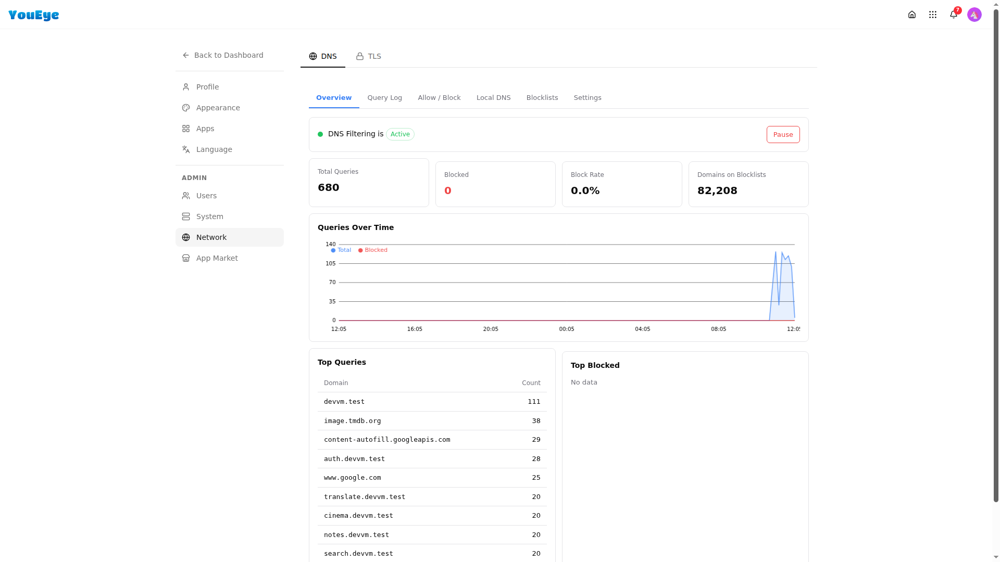

# Settings

Access settings from the user menu (top-right avatar → Settings) or navigate directly to `/settings`.

## Profile

  

Manage your account identity:

- **Display Name** — How your name appears across the platform
- **Email** — Your login email address
- **Avatar** — Upload a profile picture
- **Password** — Change your account password

---

## Appearance

  

Customize the look and feel of your dashboard:

- **Color Theme** — Choose from preset color palettes or create your own using the OKLCH color picker
- **Mode** — Switch between light and dark mode, or set it to follow your system preference
- **Animated Background** — Enable or disable the shader gradient background
- **Widget Style** — Adjust widget transparency and border radius

The OKLCH color system ensures perceptually uniform colors — themes look consistent across light and dark modes.

---

## Apps

  

View and manage all installed apps:

- See which apps are installed and their current versions
- Uninstall apps you no longer use
- Apps include both native (built-in) and marketplace (third-party) apps

---

## Language

  

Set your preferred language. The choice propagates across the entire platform:

- Dashboard UI
- All native apps
- System notifications
- Settings interface

Supported languages are added with each release.

---

## Users

  

Manage platform users (admin only):

- **Invite users** — Add new users to your platform
- **View all users** — See registered accounts
- **Manage roles** — Assign admin or regular user permissions
- **Remove users** — Revoke access

Users are managed through Authentik SSO — changes here sync across all apps automatically.

---

## System

  

Platform-wide system settings:

- **Platform Name** — Customize the name shown in the UI and browser tab
- **Domain** — View and change your platform's domain
- **Updates** — Check for and apply platform updates
- **Backups** — Configure backup schedules and view backup history
- **Maintenance** — System maintenance operations

---

## Network

  

Network and connectivity configuration:

- **DNS** — View DNS filtering status (Pi-Hole integration)
- **Reverse Proxy** — View Caddy routing configuration
- **Ports** — See which ports are in use
- **Certificates** — TLS certificate status

---

## App Market

  

Browse and install apps from the marketplace:

- **Browse** — See all available apps with descriptions and screenshots
- **Search** — Find apps by name or category
- **Install** — One-click install deploys the app automatically
- **Categories** — Filter by type (productivity, media, utilities, etc.)

See [Apps → Marketplace](apps.md#marketplace) for more details.
